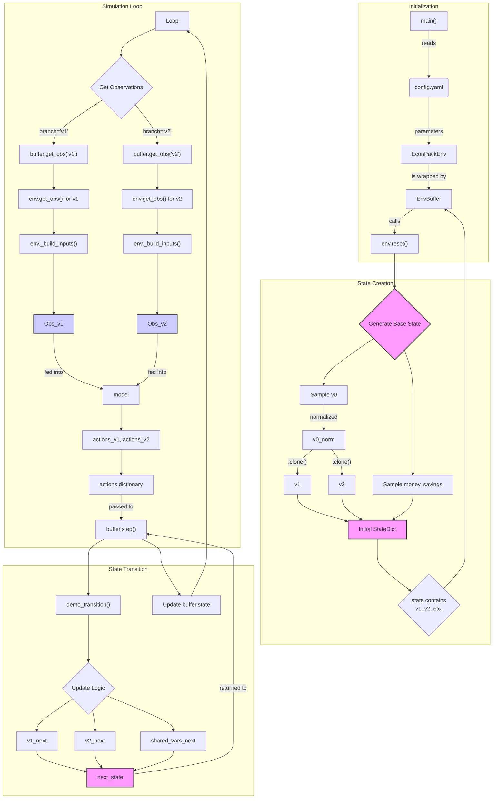

# SML-2 Project

## Environment Data Flow

This diagram illustrates the data flow within the simulation environment, particularly how two parallel economies are created and managed from a single state object.

### Explanation of the Flow

1.  **Initialization (`main.py`)**:
    *   The `main()` function loads a configuration.
    *   It creates an `EconPackEnv` instance, which knows how to create initial states and format them into observations.
    *   This `env` is then wrapped by `EnvBuffer`, which holds the state and manages simulation steps.
    *   `EnvBuffer` immediately calls `env.reset()` to create the initial `state`.

2.  **State Creation (`EconPackEnv.reset`)**:
    *   This is where the parallel economies are born.
    *   It samples a *single* base tensor `v0`.
    *   **The Key Step**: It creates `v1 = v0.clone()` and `v2 = v0.clone()`. By using `.clone()`, it ensures `v1` and `v2` start with identical values but are two separate tensors. Future modifications to one will not affect the other.
    *   The initial `state` dictionary, containing both `v1` and `v2`, is returned.

3.  **Simulation Loop (`main.py`)**:
    *   At each step `t`:
    *   **Observation Generation**: `buffer.get_obs()` is called twice, once for each "branch" (`v1` and `v2`), creating two sets of observations for the model.
    *   **Model Inference**: The model processes both sets of observations to produce actions for each parallel economy.
    *   **State Transition**: `buffer.step()` is called, passing the actions and the `demo_transition` function.

4.  **State Transition (`EnvBuffer.step` & `demo_transition`)**:
    *   `demo_transition` receives the current state and actions.
    *   It calculates `v1_next` and `v2_next` *independently* using their respective growth rates.
    *   It calculates the next values for shared variables (e.g., `money_next`).
    *   It packs everything into a `next_state` dictionary, which is used to update the buffer's state for the next iteration.

## Labor FOC loss

TAX_PARAMS = {
    "tax_consumption": 0.065,          # Consumption tax (fixed)
    "tax_income": 0.2,                # Tax on labor income
    "income_tax_elasticity": 0.5,     # Elasticity of labor supply w.r.t. after-tax income
    "saving_tax_elasticity": 0.5,     # Elasticity of savings w.r.t. after-tax income
    "tax_saving": 0.1                 # Tax on interest income
}

converge

TAX_PARAMS = {
    "tax_consumption": 0.065,          # Consumption tax (fixed)
    "tax_income": 0.5,                # Tax on labor income
    "income_tax_elasticity": 0.5,     # Elasticity of labor supply w.r.t. after-tax income
    "saving_tax_elasticity": 0.5,     # Elasticity of savings w.r.t. after-tax income
    "tax_saving": 0.5                 # Tax on interest income
}

diverge for gamma = 2 or gamma = 0.5